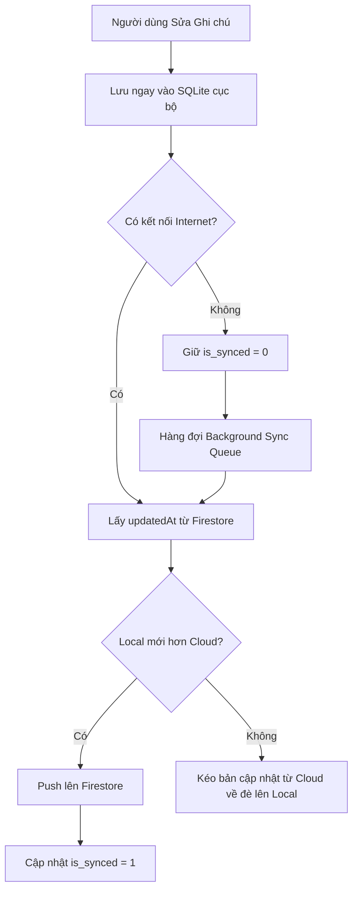
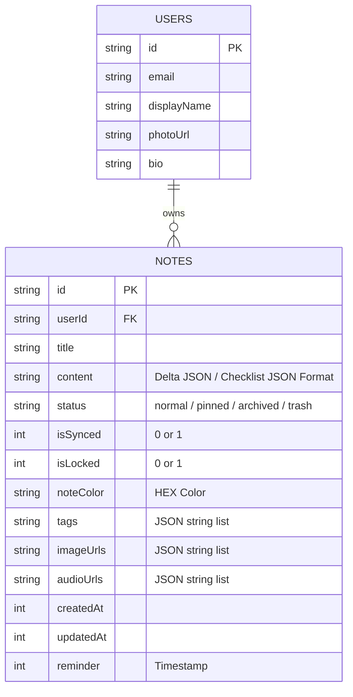

# Smart Note App

[](https://flutter.dev)
[](https://dart.dev)
[](https://firebase.google.com)
[](https://sqlite.org)
[](https://pub.dev/packages/provider)
[](https://clean-architecture)

> **Smart Note App** là ứng dụng ghi chú thông minh hoạt động theo mô hình **Offline-First**, hỗ trợ đồng bộ hóa đám mây thời gian thực, thiết kế theo phong cách Google Keep và được trang bị trình soạn thảo Rich Text vô cùng mạnh mẽ.
> 
> Dự án được xây dựng bằng Flutter + Firebase + SQLite, áp dụng mô hình Clean Architecture để tối ưu khả năng mở rộng, bảo trì và hiệu năng siêu tốc.

---

## ✨ Tính năng nổi bật

### 1. Offline-First & Last-Writer-Wins Architecture
* **Lưu trữ tức thì:** Ghi chú được lưu ngay lập tức vào SQLite cục bộ.
* **Không độ trễ:** Hoạt động trơn tru kể cả khi hoàn toàn mất mạng internet.
* **Xử lý Xung đột Thông minh:** Sử dụng thuật toán **Last-Writer-Wins** (Dữ liệu mới nhất sẽ chiến thắng) để tự động đối chiếu thời gian chỉnh sửa (`updatedAt`) giữa Firebase và SQLite, ngăn chặn tuyệt đối việc mất dữ liệu khi người dùng chỉnh sửa cùng 1 ghi chú trên nhiều thiết bị.

### 2. Background Cloud Sync
* **Đồng bộ ngầm:** Tự động đẩy dữ liệu lên Firebase Cloud Firestore ngay khi có mạng trở lại.
* **Tối ưu băng thông:** Chỉ đồng bộ những bản ghi thực sự có sự thay đổi (Dựa trên cờ `is_synced`).
* **Đồng bộ tự động:** Hỗ trợ tính năng tự động tải (Pull) ghi chú mới nhất từ đám mây xuống.

### 3. Multimedia Rich Text Editor
* **flutter_quill WYSIWYG:** Trình soạn thảo văn bản phong phú, cho phép In đậm, In nghiêng, Đổi màu chữ/nền, Heading (H1, H2...), Danh sách đạn, Checkbox công việc.
* **Chuyển đổi dữ liệu tự động:** Khả năng tương thích ngược siêu việt, tự động chuyển đổi các text thuần (plain text) cũ sang định dạng siêu nhẹ `Delta JSON`.
* **Đính kèm Đa phương tiện:** Hỗ trợ đính kèm hình ảnh và bản Ghi âm (`.m4a`) chất lượng cao. Audio có thể phát lại trực tiếp ngay trong ứng dụng với thanh thời gian thực.

### 4. Giao diện Google Keep-Style
* **Staggered Grid View:** Bố cục hiển thị lưới sinh động, thông minh (Masonry Grid layout).
* **Ghim (Pin) & Lưu trữ (Archive):** Sắp xếp ghi chú quan trọng lên đầu, cất gọn những ghi chú cũ.
* **Bộ chọn nhãn (Labels):** Nhóm và quản lý các ghi chú bằng tags dễ dàng.
* **Tìm kiếm toàn văn bản:** Tìm kiếm nhanh theo thời gian thực sử dụng FTS5 và lọc theo các tiêu chí (ảnh, ghi âm, URL, nhãn).

### 5. Trợ lý ảo Gemini AI & Các tính năng nâng cao
* **Tích hợp Gemini AI:** Tự động đề xuất tiêu đề, tạo bản tóm tắt ngắn, gợi ý tag thông minh và chuyển đổi văn bản thô sang Checklist.
* **Bảo mật Sinh trắc học:** Bảo mật từng ghi chú bằng Vân tay / FaceID (`local_auth`), tự động khóa lại khi thoát app hoặc chạy ngầm.
* **Hẹn giờ nhắc nhở:** Lên lịch thông báo cục bộ (`flutter_local_notifications`) chính xác theo múi giờ, hoạt động ổn định kể cả khi offline.
* **Bảng vẽ tự do (Drawing Board):** Canvas vẽ hình học (shapes), template giấy (kẻ ngang, ô ly), tùy chọn nét vẽ và hỗ trợ undo/redo.
* **Xuất PDF & Đa ngôn ngữ:** Xuất ghi chú kèm hình ảnh ra file PDF sắc nét để chia sẻ/in ấn. Hỗ trợ thay đổi ngôn ngữ Anh / Việt tức thời.

---

## 🏗️ Clean Architecture

Ứng dụng tuân thủ nghiêm ngặt mô hình Clean Architecture để tách biệt giao diện, logic trạng thái, và thao tác dữ liệu:

```mermaid
flowchart TB
    subgraph UI["UI Layer (Screens & Widgets)"]
        HS[HomeScreen]
        ES[EditorScreen]
        LS[LoginScreen]
        DS[DrawingScreen]
        AS[ArchiveScreen]
        TS[TrashScreen]
        PS[ProfileScreen]
    end

    subgraph STATE["State Layer (Providers)"]
        NP[NoteProvider]
        AP[AuthProvider]
        SP[SyncProvider]
        TP[ThemeProvider]
        LP[LanguageProvider]
    end

    subgraph REPO["Repository Layer (Interfaces & Impl)"]
        NR[NoteRepository]
        SR[SyncRepository]
    end

    subgraph SERVICE["Service Layer (APIs & Local)"]
        LNS[LocalNoteService]
        FNS[FirestoreNoteService]
        PDS[PendingDeleteService]
        CLS[CloudinaryService]
        BMS[BiometricService]
        RMS[ReminderService]
        PES[PdfExportService]
        GAS[GeminiAiService]
    end

    subgraph STORAGE["Storage (Data Sources)"]
        SQ[(SQLite)]
        FB[(Firestore)]
        CD[(Cloudinary)]
    end

    UI --> STATE
    STATE --> REPO
    REPO --> SERVICE
    SERVICE --> STORAGE
```



---

## 🔄 Đồng bộ dữ liệu Offline-First (Last-Writer-Wins)



---

## 🗄️ ERD Database Design



---

## 📂 Project Structure

```bash
lib/
├── core/           # App configuration (AppColors, AppStrings, AppTheme, Localization)
├── features/       # Feature modules (Editor sheets/widgets, Home widgets, Profile dialogs)
├── models/         # Entity models (Note, User, ChecklistItem, SyncStatus)
├── providers/      # State Management (NoteProvider, SyncProvider, AuthProvider, Theme, Language)
├── repositories/   # Abstract repositories & Implementations
├── screens/        # UI Screens (Home, Editor, Drawing, Settings, Profile, Trash, Archive, Sync)
├── services/       # Local SQLite handlers, Firestore Sync, Cloudinary, Biometrics, Notifications, Gemini AI, PDF Export
├── widgets/        # Reusable shared UI components (NoteCard, Drawer, Shimmer)
└── main.dart       # App entry point
```

---

## 🛠️ Technologies Used

| Technology       | Purpose                     |
| ---------------- | --------------------------- |
| **Flutter**      | Cross-platform UI Framework |
| **Firebase Auth**| Google Sign-In & Authentication |
| **Cloud Firestore**| Realtime Cloud Database    |
| **Firebase Storage**| Audio & Image Storage       |
| **SQLite (sqflite)**| Offline Local Database      |
| **Provider**     | App State Management        |
| **flutter_quill**| Rich Text Editor (WYSIWYG)  |
| **just_audio / record** | Voice Note Playback & Recording |
| **local_auth**   | Biometric Authentication (FaceID/Vân tay) |
| **flutter_local_notifications** | Timezone-aware Offline Reminders |
| **firebase_ai**  | Gemini AI Note Assistant |
| **Cloudinary (HTTP)** | Cloud Image & Audio Management |
| **pdf / printing**| Export notes to clean PDF files |
| **flutter_dotenv**| Environment Variables Security |

---

## 🚀 Installation & Setup

### Requirements

* Flutter SDK >= 3.0.0
* Dart SDK >= 3.0.0
* Android Studio / VS Code

### Setup

```bash
# 1. Clone dự án
git clone <YOUR_REPOSITORY_URL>
cd smart-note-app

# 2. Xóa cache và nạp lại thư viện
flutter clean
flutter pub get
```

### Firebase & Môi trường Configuration
1. Tạo project trên Firebase Console. Thêm ứng dụng Android (`com.example.smart_note_app`).
2. Tải `google-services.json` và đặt vào thư mục `android/app/`.
3. Bật **Authentication** (Google Sign In), **Firestore**, và **Storage** trên Firebase Console.
4. Tạo file `.env` ở thư mục gốc của dự án để cấu hình các biến môi trường nếu có.

---

## 🧪 Testing Scenarios (Kịch bản Kiểm thử)

> 📘 **Tài liệu kiểm thử chi tiết:** Xem báo cáo kiểm thử đầy đủ tại [Testing_Report.md](file:///d:/Workspace/TBDD/Smart-Note-App/docs/Testing_Report.md) bao gồm Unit Tests, Widget Tests, Security Rules và các kịch bản kiểm thử tích hợp thủ công.

### 1. App ↔ Firebase Realtime
* Tạo ghi chú mới có chứa ảnh và định dạng chữ. 
* Quay lại màn hình chính, kiểm tra Firestore xem dữ liệu (JSON Delta) đã được tải lên chưa.

### 2. Multi-device Conflict Resolution
* Đăng nhập cùng 1 tài khoản trên 2 máy (A và B).
* Tắt mạng máy A, sửa Ghi chú 1.
* Trên máy B, sửa Ghi chú 1 và lưu lại lên Cloud.
* Bật mạng máy A, bấm "Đồng bộ ngay". App sẽ báo phát hiện Cloud có dữ liệu mới hơn và tự động kéo dữ liệu từ máy B về mà không đè mù dữ liệu cũ.

### 3. Offline Mode
* Tắt WiFi/4G. Viết ghi chú mới, thu âm giọng nói.
* Ghi chú vẫn lưu mượt mà. Đóng app mở lại dữ liệu vẫn còn.
* Bật WiFi lại, hệ thống tự động tải file thu âm lên Firebase Storage và đẩy ghi chú lên Firestore.

---

## 📦 Production Build

Để xuất file cài đặt APK tối ưu dung lượng và bảo mật mã nguồn:

```bash
flutter build apk --release --obfuscate --split-debug-info=build/app/outputs/symbols
```

---

## 🔮 Future Improvements (Dự định Tương lai)

* **OCR Text Recognition:** Trích xuất chữ từ hình ảnh bằng AI.
* **Real-time Collaboration:** Cùng chỉnh sửa ghi chú thời gian thực nhiều người dùng.
* **Voice-to-Text Transcription:** Chuyển đổi trực tiếp các file ghi âm giọng nói thành văn bản.
* **Geotagging & Location Notes:** Gắn thẻ địa lý và hiển thị bản đồ trong ghi chú.
* **Web/Desktop Optimization:** Hoàn thiện tối ưu hóa hiệu năng và tương thích giao diện gốc trên Web và Desktop.

---

*Được phát triển với niềm đam mê dành cho Flutter & Kiến trúc phần mềm hoàn hảo! 💙*
