# 📐 Bộ Sơ đồ Kiến trúc & Luồng Hoạt động – Smart Note App

> **Mô tả:** Tài liệu này tổng hợp toàn bộ các sơ đồ kỹ thuật của dự án Smart Note, bao gồm kiến trúc hệ thống, luồng dữ liệu, sơ đồ lớp, sơ đồ trạng thái, ERD và sơ đồ trình tự (Sequence Diagram).

---

## 📑 Mục lục

1. [Sơ đồ Kiến trúc Tổng thể (Architecture Diagram)](#1-sơ-đồ-kiến-trúc-tổng-thể)
2. [Sơ đồ Cấu trúc Thư mục (Project Structure)](#2-sơ-đồ-cấu-trúc-thư-mục)
3. [Sơ đồ Lớp (Class Diagram)](#3-sơ-đồ-lớp-class-diagram)
4. [Sơ đồ Thực thể Quan hệ (ERD)](#4-sơ-đồ-thực-thể-quan-hệ-erd)
5. [Sơ đồ Trạng thái Ghi chú (State Diagram)](#5-sơ-đồ-trạng-thái-ghi-chú)
6. [Luồng Đồng bộ Dữ liệu (Sync Flow)](#6-luồng-đồng-bộ-dữ-liệu)
7. [Luồng Lưu Ghi chú Đầy đủ (Full Save Flow)](#7-luồng-lưu-ghi-chú-đầy-đủ)
8. [Luồng Xác thực Sinh trắc học (Biometric Auth Flow)](#8-luồng-xác-thực-sinh-trắc-học)
9. [Sơ đồ Trình tự – Tạo Ghi chú (Sequence Diagram: Create Note)](#9-sơ-đồ-trình-tự--tạo-ghi-chú)
10. [Sơ đồ Trình tự – Đăng nhập & Đồng bộ (Sequence Diagram: Login & Sync)](#10-sơ-đồ-trình-tự--đăng-nhập--đồng-bộ)
11. [Luồng Điều hướng Màn hình (Navigation Flow)](#11-luồng-điều-hướng-màn-hình)
12. [Luồng Upload Đa phương tiện (Multimedia Upload Flow)](#12-luồng-upload-đa-phương-tiện)
13. [Sơ đồ Deployment (CI/CD Pipeline)](#13-sơ-đồ-deployment-cicd-pipeline)

---

## 1. Sơ đồ Kiến trúc Tổng thể

> Kiến trúc 4 lớp theo **Clean Architecture**: UI → Provider → Repository → Service/Storage.

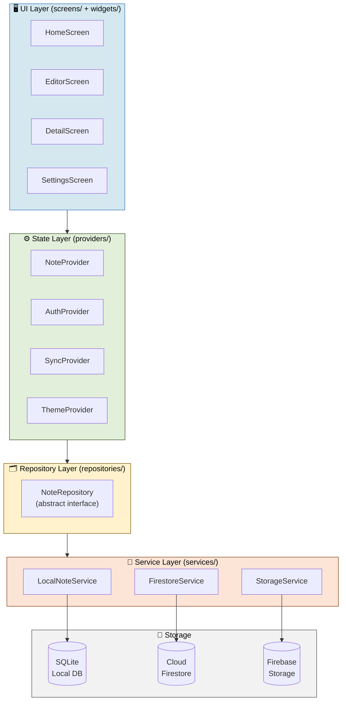

---

## 2. Sơ đồ Cấu trúc Thư mục

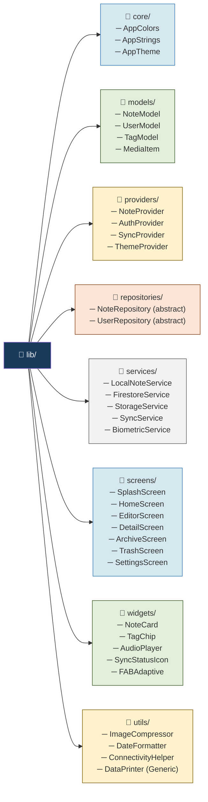

---

## 3. Sơ đồ Lớp (Class Diagram)

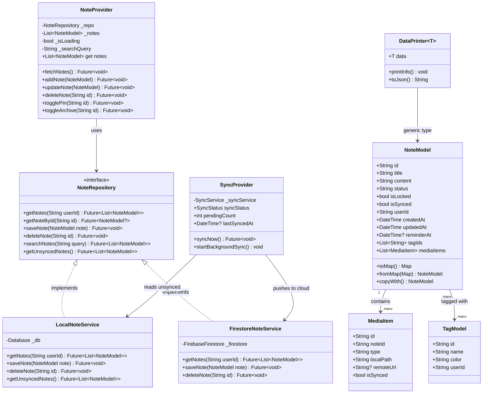

---

## 4. Sơ đồ Thực thể Quan hệ (ERD)

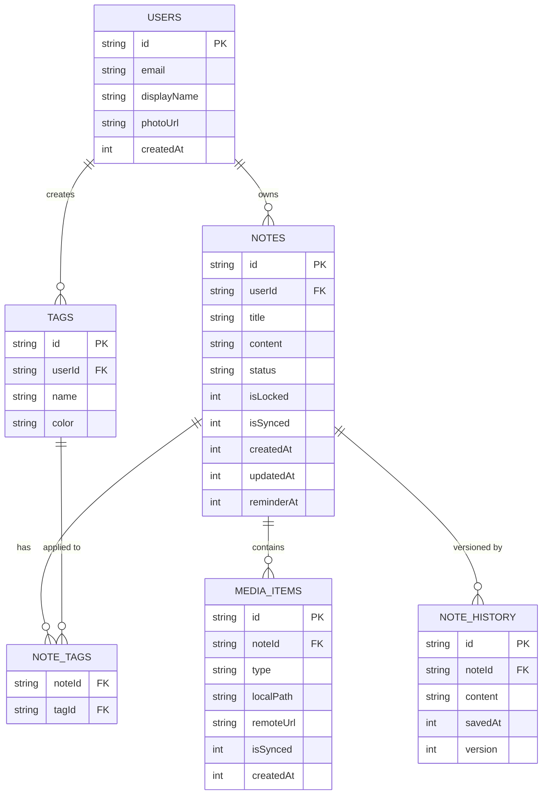

---

## 5. Sơ đồ Trạng thái Ghi chú

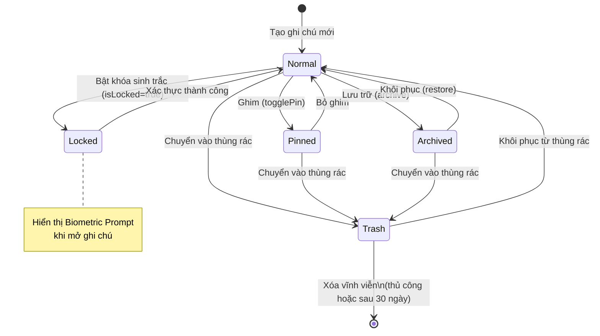

---

## 6. Luồng Đồng bộ Dữ liệu

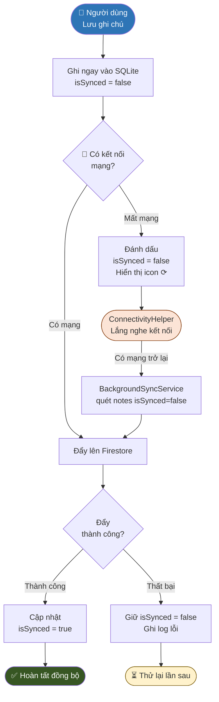

---

## 7. Luồng Lưu Ghi chú Đầy đủ

```mermaid
flowchart LR
    START([👤 Nhấn Lưu]) --> VALID{Validate\nnội dung}
    VALID -- Rỗng --> ERR([❌ Báo lỗi\n"Tiêu đề không được trống"])
    VALID -- Hợp lệ --> UUID[Sinh UUID\ncho note]
    UUID --> MEDIA{Có file\nMedia?}

    MEDIA -- Có ảnh --> COMPRESS[Nén ảnh\n< 1MB]
    COMPRESS --> SQLMEDIA[Lưu MediaItem\nvào SQLite]
    MEDIA -- Không --> SQLNOTE

    SQLMEDIA --> SQLNOTE[Lưu NoteModel\nvào SQLite]
    SQLNOTE --> NOTIFY[Cập nhật\nNoteProvider.notes]
    NOTIFY --> UI([🖥️ UI refresh\nHiển thị ghi chú mới])

    NOTIFY --> SYNC{Có mạng?}
    SYNC -- Có --> UPLOAD_MEDIA{Có Media\nchưa sync?}
    UPLOAD_MEDIA -- Có --> STORAGE[Upload ảnh\nlên Firebase Storage]
    STORAGE --> FIRESTORES[Lưu Note\nlên Firestore]
    UPLOAD_MEDIA -- Không --> FIRESTORES
    FIRESTORES --> MARK[Đánh dấu\nisSynced = true]

    SYNC -- Không --> QUEUE([📋 Queue đồng bộ\ncho lần sau])

    style START fill:#2E75B6,color:#fff
    style UI fill:#375623,color:#fff
    style ERR fill:#D32F2F,color:#fff
    style QUEUE fill:#FFF2CC,stroke:#7D5C00
```

---

## 8. Luồng Xác thực Sinh trắc học

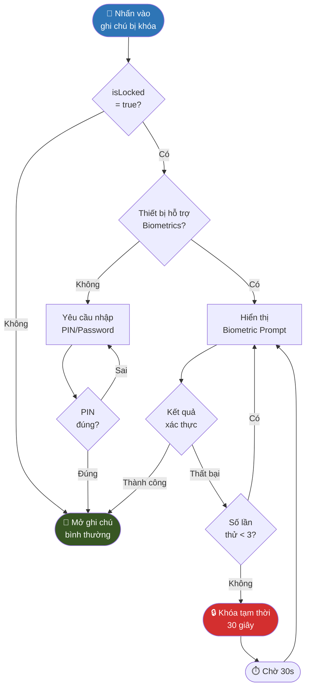

---

## 9. Sơ đồ Trình tự – Tạo Ghi chú

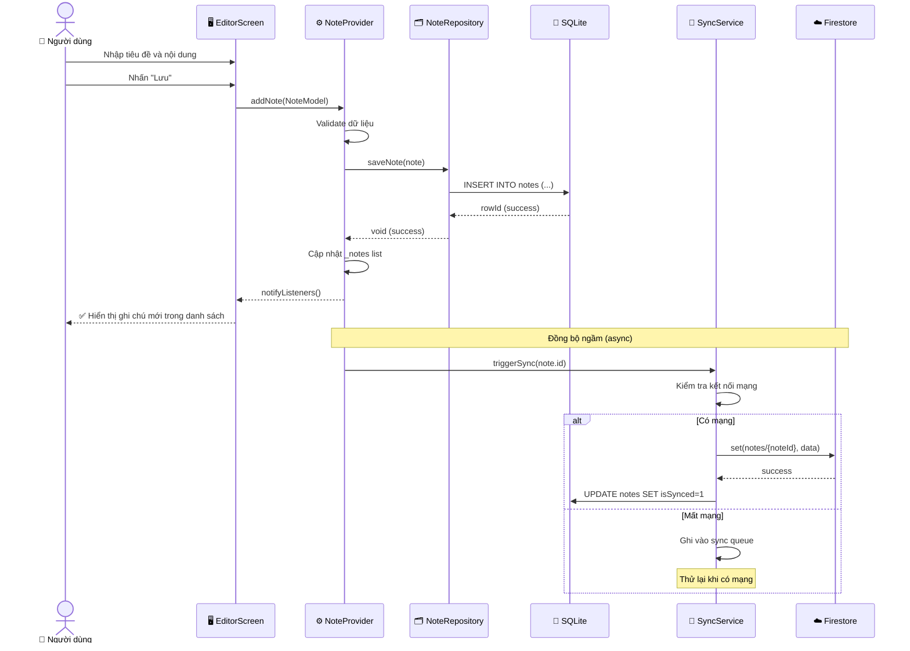

---

## 10. Sơ đồ Trình tự – Đăng nhập & Đồng bộ

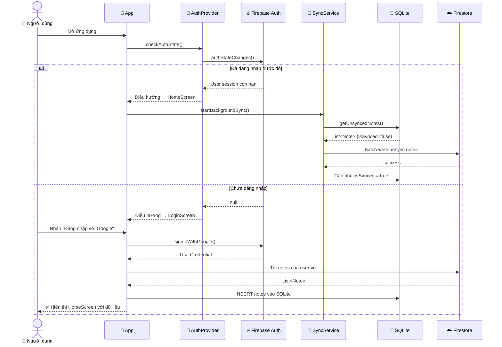

---

## 11. Luồng Điều hướng Màn hình

```mermaid
flowchart TD
    SPLASH[🚀 SplashScreen\n2s animation] --> AUTH_CHECK{Đã\nđăng nhập?}

    AUTH_CHECK -- Không --> LOGIN[🔐 LoginScreen\nGoogle / Email]
    LOGIN --> HOME

    AUTH_CHECK -- Có --> HOME[🏠 HomeScreen\nStaggered Grid]

    HOME --> EDITOR_NEW[📝 EditorScreen\nTạo ghi chú mới]
    HOME --> DETAIL[👁️ DetailScreen\nXem chi tiết]
    HOME --> SEARCH[🔍 SearchScreen\nTìm kiếm full-text]
    HOME --> MENU[☰ Navigation Drawer]

    MENU --> ARCHIVE[🗄️ ArchiveScreen]
    MENU --> TRASH[🗑️ TrashScreen]
    MENU --> TAGS[🏷️ TagManagerScreen]
    MENU --> SETTINGS[⚙️ SettingsScreen]

    DETAIL --> EDITOR_EDIT[📝 EditorScreen\nChỉnh sửa]
    DETAIL --> BIO[🔒 BiometricPrompt\n(nếu isLocked=true)]
    BIO --> DETAIL

    SETTINGS --> THEME[🎨 Theme Settings]
    SETTINGS --> ACCOUNT[👤 Account Settings]
    SETTINGS --> SECURITY[🛡️ Security Settings]

    style SPLASH fill:#1A3A5C,color:#fff
    style HOME fill:#2E75B6,color:#fff
    style LOGIN fill:#FCE4D6,stroke:#843C0C
    style BIO fill:#D32F2F,color:#fff
```

---

## 12. Luồng Upload Đa phương tiện

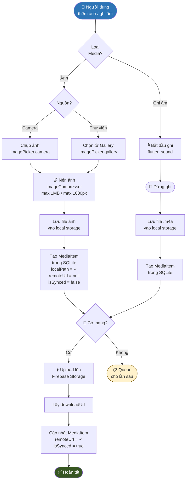

---

## 13. Sơ đồ Deployment (CI/CD Pipeline)

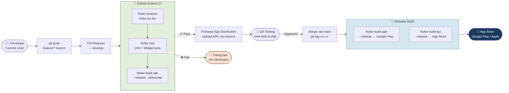

---

## 📊 Tổng kết Sơ đồ

| # | Tên sơ đồ | Loại | Mục đích |
|---|-----------|------|----------|
| 1 | Kiến trúc Tổng thể | Flowchart | Tổng quan 4-layer Clean Architecture |
| 2 | Cấu trúc Thư mục | Graph | Tổ chức code trong dự án |
| 3 | Sơ đồ Lớp | Class Diagram | Quan hệ giữa các class |
| 4 | ERD | ER Diagram | Schema SQLite & Firestore |
| 5 | Sơ đồ Trạng thái | State Diagram | Vòng đời của một ghi chú |
| 6 | Luồng Đồng bộ | Flowchart | Offline-First Sync Strategy |
| 7 | Luồng Lưu Ghi chú | Flowchart | Chi tiết quá trình save note |
| 8 | Biometric Auth | Flowchart | Luồng xác thực sinh trắc |
| 9 | Sequence: Tạo Note | Sequence | Tương tác giữa các lớp khi tạo note |
| 10 | Sequence: Login & Sync | Sequence | Luồng đăng nhập và đồng bộ dữ liệu |
| 11 | Navigation Flow | Flowchart | Điều hướng giữa các màn hình |
| 12 | Multimedia Upload | Flowchart | Luồng xử lý ảnh và ghi âm |
| 13 | CI/CD Pipeline | Flowchart | Quy trình build và deploy |

---

> **Lưu ý:** Tất cả sơ đồ được viết bằng cú pháp **Mermaid**. Để render, mở file này trong VS Code với extension *Markdown Preview Mermaid Support*, hoặc truy cập [mermaid.live](https://mermaid.live) để xem trực tiếp.
>
> File tài liệu chi tiết: `Smart_Note_Project_Description.docx`
